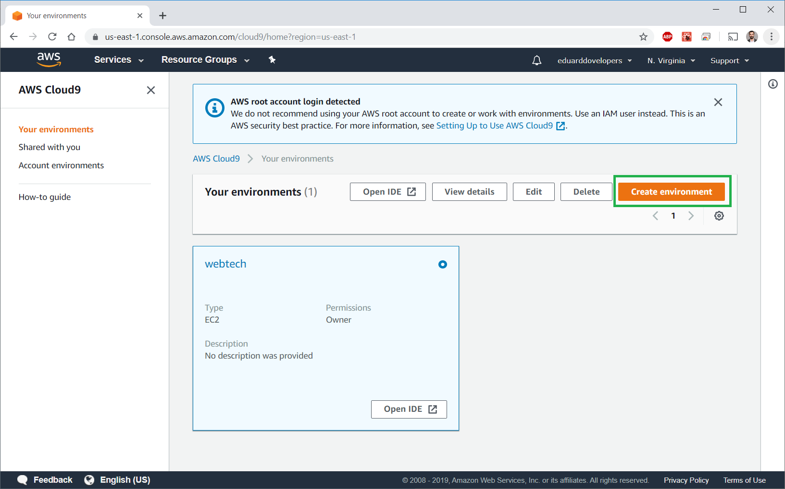
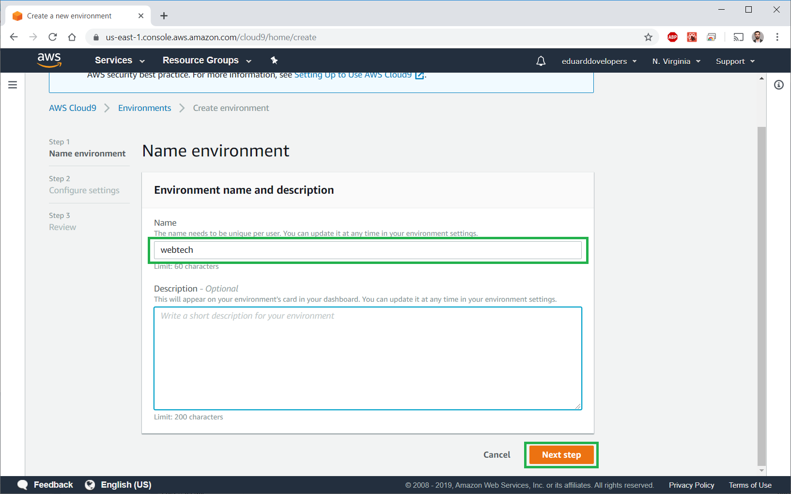
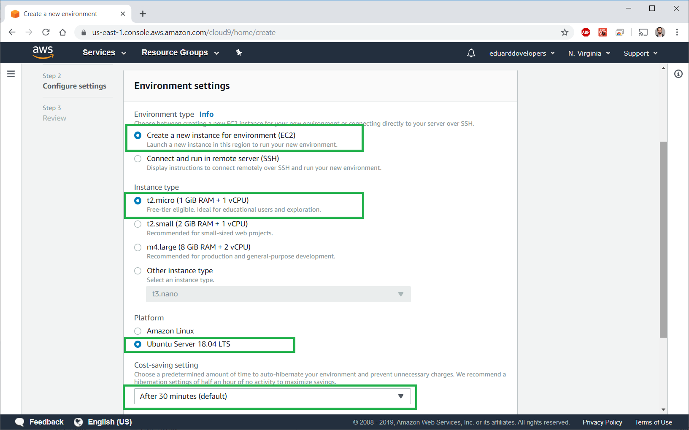
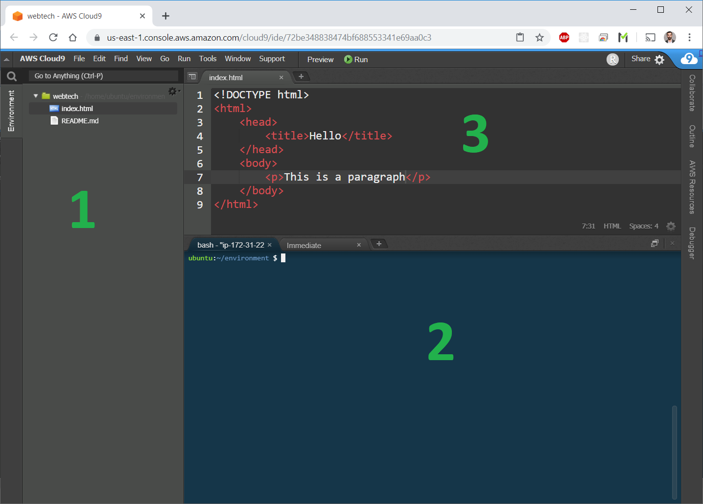
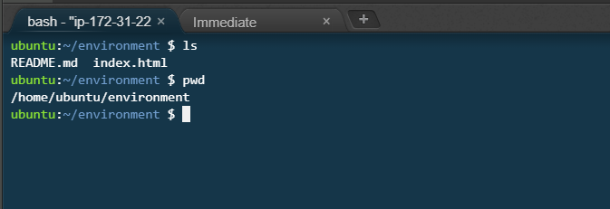
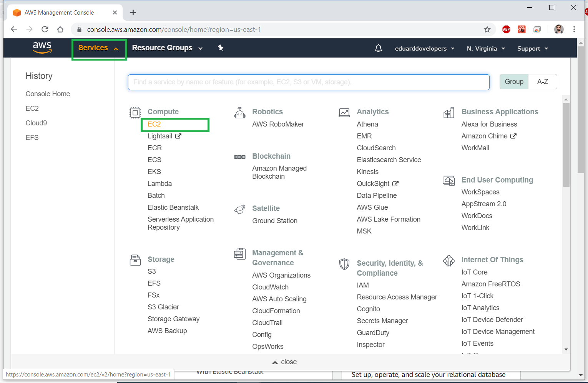
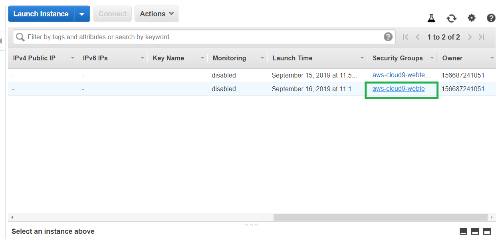
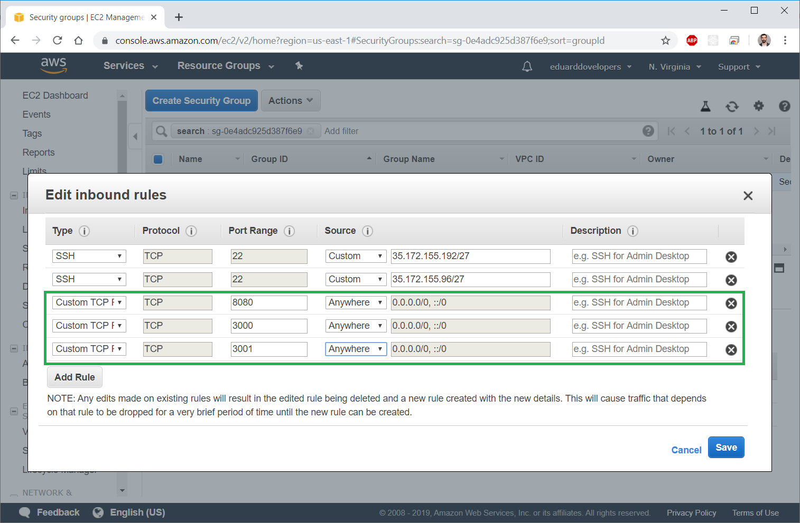

# Cloud9 în AWS

Activitățile propuse la seminariu vor fi desfășurate pe mediul de lucru [Cloud9](https://aws.amazon.com/cloud9/).

Cloud9 este un mediu integrat ce rulează pe o mașină virtuală în cloud-ul Amazon Web Services (AWS). Include un editor de text, manager de fișiere și un terminal Linux pe care le accesați direct din browser-ul web.

Pentru a accesa un astfel de mediu de lucru aveți nevoie de un cont de Amazon Web Services \(AWS\) pe care îl creați [aici](https://aws.amazon.com/cloud9/). 

Completând pașii din formularul de înregistrare deveniți eligibili pentru pachetul gratuit. Înainte de a folosi serviciile vă sugerez să consultați ce este inclus în pachet și să vă asigurați utilizați doar acele resurse care nu generează costuri suplimentare. 

Detaliile sunt disponibile [aici](https://aws.amazon.com/free/).

## Configurarea unui environment Cloud9

Versiunea detaliată a documentației este disponibilă la adresa [https://docs.aws.amazon.com/cloud9/latest/user-guide/welcome.html](https://docs.aws.amazon.com/cloud9/latest/user-guide/welcome.html)

În continuare urmărește instrucțiunile pentru a configura un mediu C9

1. Navighează în consola C9

[https://console.aws.amazon.com/cloud9/](https://console.aws.amazon.com/cloud9/)

1. Apasă butonul "Create environment"



1. Pasul 1 - Furnizează un nume pentru mediul de lucru



1. Pasul 2 - Configurează mediul de lucru

**Important!** Alege o instanță de tipul _**t1.micro**_ pentru a te încadra în pachetul gratuit. Alege platforma _**Ubuntu Server 18.04**_.



1. Pasul 3 - Confirmă setările și apasă "Create environment"

Vei fi redirecționat către o nouă pagină. După câteva minute mediul de lucru va fi configurat.


## Familiarizare cu mediul de lucru

Un tur complet al mediului de lucru este disponibil la adresa [https://docs.aws.amazon.com/cloud9/latest/user-guide/tour-ide.html](https://docs.aws.amazon.com/cloud9/latest/user-guide/tour-ide.html)

Funcțiile pe care le vom utiliza cel mai des sunt:

1. Managerul de fișisiere
2. Terminalul bash
3. Editorul de text



**Managerul de fișiere** este localizat în partea stângă. Aici vor fi listate directoarele și fișierele din `/home/ubuntu/environment`.

**Terminalul bash** este localizat în partea dreaptă jos. Aici este zona în care executăm comenzile.

Listează directorul curent:

```bash
ls
```

Afișează calea către directorul curent:

```bash
pwd
```



**Editorul de text** este localizat în partea dreaptă sus.

## Setări de firewall

În continuare trebuie să configurăm setările de firewall astfel încât să permitem accesul la port-urile pe care le vom folosi în mod frecvent.

1. Navighează în consola AWS - [https://console.aws.amazon.com/ec2/](https://console.aws.amazon.com/ec2/)



1. Afișează instanțele EC2


1. Găsește în tabel opțiunea Security Groups



1. Navighează în tabul Inbound și apasă Edit


1. Adaugă porturile `8080, 3000, 3001`



1. Apasă butonul Save

