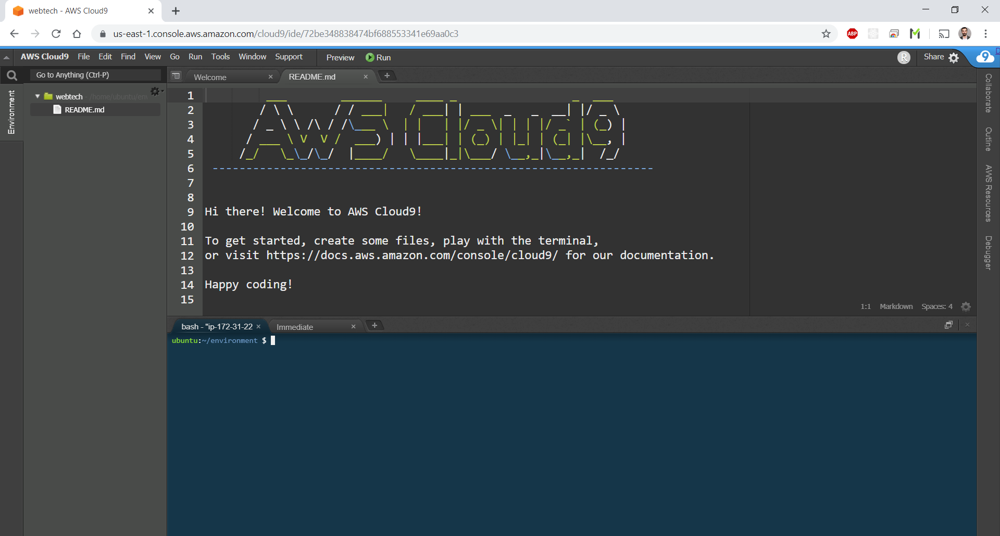
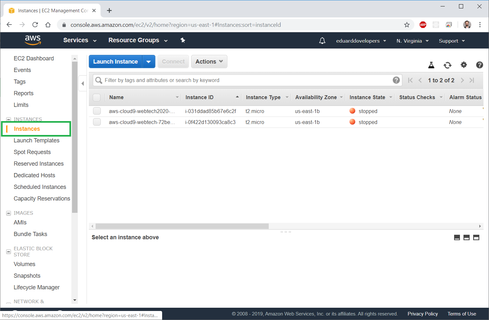
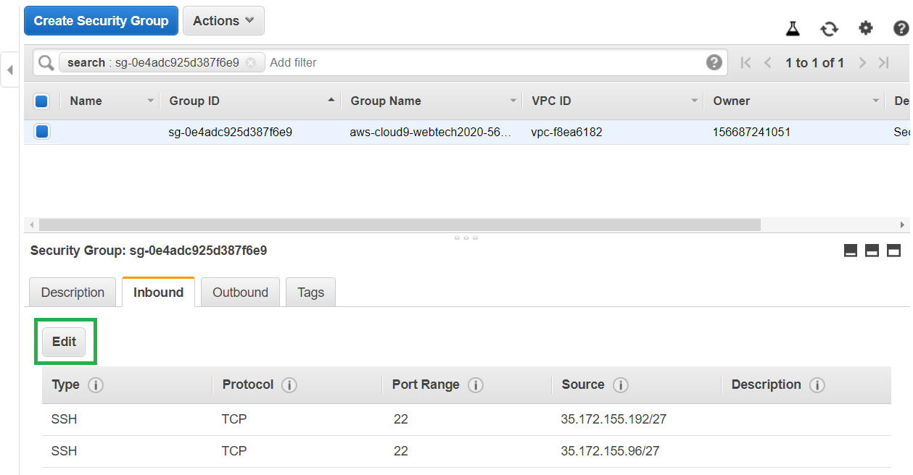

# Cloud9 în AWS

Activitățile propuse la seminariu pot fi desfășurate pe mediul de lucru [Cloud9](https://aws.amazon.com/cloud9/). 

Cloud9 este un mediu integrat ce rulează pe o instanță virtuală. Include un editor de text, manager de fișiere și un terminal Linux pe care le accesați direct din browser-ul web.

Pentru a accesa un astfel de mediu de lucru aveți nevoie de un cont de Amazon Web Services (AWS) pe care îl creați [aici](https://aws.amazon.com/cloud9/). Completând pașii din formularul de înregistrare deveniți eligibili pentru pachetul gratuit. Înainte de a folosi serviciile vă sugerez să consultați ce este inclus în pachet și să vă asigurați utilizați doar acele resurse care nu generează costuri suplimentare. Detaliile sunt disponibile [aici](https://aws.amazon.com/free/).

## Configurarea unui environment Cloud9

Versiunea detaliată a documentației este disponibilă la adresa https://docs.aws.amazon.com/cloud9/latest/user-guide/welcome.html

În continuare urmărește instrucțiunile pentru a configura un mediu C9

1. Navighează în consola C9

https://console.aws.amazon.com/cloud9/

2. Apasă butonul "Create environment"


3. Pasul 1 - Furnizează un nume pentru mediul de lucru


4. Pasul 2 - Configurează mediul de lucru

**Important!** Alege o instanță de tipul ***t1.micro*** pentru a te încadra în pachetul gratuit. Alege platforma ***Ubuntu Server 18.04***.


5. Pasul 3 - Confirmă setările și apasă "Create environment"

Vei fi redirecționat către o nouă pagină. După câteva minute mediul de lucru va fi configurat.



## Familiarizare cu mediul de lucru

Un tur complet al mediului de lucru este disponibil la adresa https://docs.aws.amazon.com/cloud9/latest/user-guide/tour-ide.html

Funcțiile pe care le vom utiliza cel mai des sunt:

1. Managerul de fișisiere
2. Terminalul bash
3. Editorul de text


**Managerul de fișiere** este localizat în partea stângă. Aici vor fi listate directoarele și fișierele din ```/home/ubuntu/environment```.

**Terminalul bash** este localizat în partea dreaptă jos. Aici este zona în care executăm comenzile. 

Listează directorul curent:

```bash
ls
```

Afișează calea către directorul curent:

```bash
pwd
```


**Editorul de text** este localizat în partea dreaptă sus.

## Setări de firewall

În continuare trebuie să configurăm setările de firewall astfel încât să permitem accesul la port-urile pe care le vom folosi în mod frecvent.

1. Navighează în consola AWS - https://console.aws.amazon.com/ec2/


2. Afișează instanțele EC2



3. Găsește în tabel opțiunea Security Groups


4. Navighează în tabul Inbound și apasă Edit



5. Adaugă porturile ```8080, 3000, 3001```


6. Apasă butonul Save

