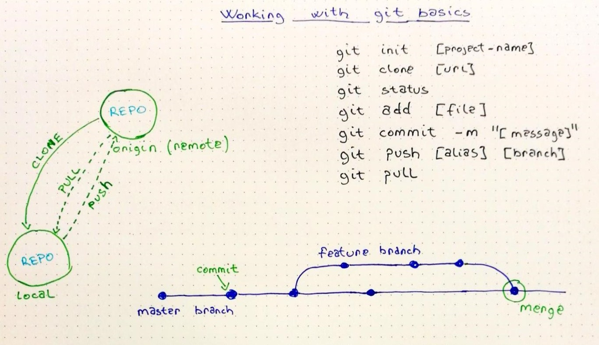

# Lucru cu git

Git este un sistem de versionare a codului extrem de util pentru lucru în echipă. Îl poți folosi local pentru a versiona fișiere text sau prin unul dintre multitudinea de platforme online precum GitHub, GitLab, BitBucket, etc.

Pentru a desfășura activitatea de la seminar vei avea nevoie de un cont pe GitHub ([https://github.com/join](https://github.com/join)).

În imaginea de mai jos am extras comenzile pe care le folosim cel mai des:



```bash
git init
git clone [url]
git status
git add [file]
git commit -m "a descriptive commit message"
git push [alias] [branch]
git pull
```

## Resurse

* [pdf cheat sheet](https://github.github.com/training-kit/downloads/github-git-cheat-sheet.pdf)
* [ghid instalare și comenzi de bază](https://rogerdudler.github.io/git-guide/)
