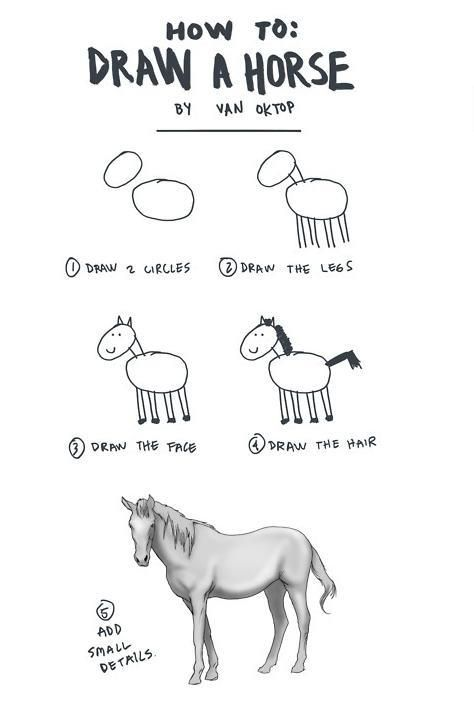

# Cum să începi să lucrezi

### Configurarea proiectului

1. Inițializarea structura proiect
2. Inițializarea bazei de date
3. Realizarea fișierului json de configurare pentru baza de date în directorul config \(exemplu [aici](https://github.com/webtech-superheroes/webtech-hub/blob/master/backend/config/db.sample.json)\)
4. Implementare mecanism automat de incărcare modele \(exemplu [aici](https://github.com/webtech-superheroes/webtech-hub/blob/master/backend/models/index.js)\)
5. Implementare script realizare structura db și date de test \(exemplu [aici](https://github.com/webtech-superheroes/webtech-hub/blob/master/backend/createdb.js)\)

### Implementare componenta backend

1. Identificarea unui model cheie din aplicație
2. Definirea modelului identificat și structurarea tabelului \(vezi [sequelize.define](https://sequelize.org/master/manual/model-basics.html#model-definition)\)
3. Sincronizare structură tabele \(vezi [sequelize.sync](https://sequelize.org/master/manual/model-basics.html#synchronizing-all-models-at-once) sau scriptul pentru realizare structura db\)
4. Definirea rutelor pentru fiecare operație CRUD \(vezi [express.Router](https://expressjs.com/en/guide/routing.html#express-router)\)
5. Definirea metodelor de controller pentru fiecare operație CRUD
6. Implementare validări la nivel de controller / model
7. Testare metode CRUD în Postman

### Implementare componenta frontend

1. Definire componenta container
2. Implementare cereri HTTP catre backend
3. Definire componente de prezentare

Acum adaugă mici detalii ...

