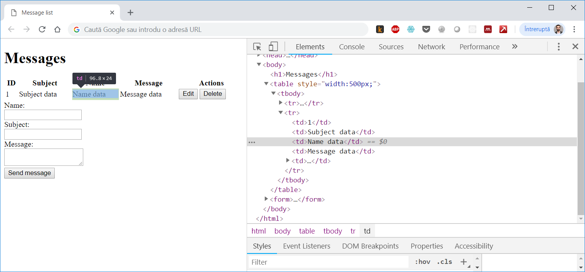

# Construirea unei interfețe folosind HTML, JQuery, Bootstrap

# Introducere

În prima parte am construit un server web capabil să servească fișiere statice și să expună date pentru a realiza operațiile de creare, citire, actualizare și ștergere (CRUD). În a doua parte vom dezvolta o interfață minimalistă cu scopul de a exemplifica metodele de comunicare între componenta de frontend și componenta de backend. 

În general dezvoltarea de frontend este un proces iterativ ce presupune realizarea de schițe de design întermediare, care sunt validate cu utilizatorii, transformarea acestora în cod HTML și CSS, implementarea de cod care gestionează interacțiunea cu utilizatorul, testare și lansare în producție. 

Dacă pe partea de backend procesul este destul de bine structurat și omogen în diferite limbaje de programare, dezvoltarea de frontend conține elemente subiective care țin de estetică, stil, aspect. 

Modul în care ajungi să realizezi o pagină web este într-o măsură diferit de procesul cu care suntem obișnuiți să rezolvăm probleme într-un context de învățare tradițional. De obicei pornim de la o serie de date de intrare pentru care trebuie să obținem un rezultat aplicând o serie de pași. Dacă ai respectat pașii corect atunci rezultatul va fi corect. În acest sens instructiunile din acest tutorial sunt mai degrabă orientative și au rolul de a oferi un punct de plecare. Scopul acestui tutorial este mai degrabă să ofere cîteva elemente de structură, să exemplifice modul de comunicare între client (frontend) și server (backend) și să demonstreze accesul la date prin HTTP.

## Realizarea unei schițe de design

În dezvoltare web pornești de cele mai multe ori de la o problemă vag definită pe care un utilizator o are, te gandești la o interfață pe care o prototipezi, realizezi o schiță de design. Pornind de la o schiță identifici elementele html necesare și determini pașii prin care să implementezi rezultatul dorit.

Vom reprezenta datele sub forma unui tabel în care fiecare rând reprezintă o înregistrare din baza de date. Tabelul va avea o secțiune de antet care va fi statică și o secțiune dinamică pe care o vom construi în funcție de datele primite de pe server. Fiecare înregistrare va permite acțiunile de editare și stergere pe care le vom reprezenta prin două elemente de tip buton.

Pentru a captura datele de la utilizator vom folosi un formular cu elemente de tip text și un buton care să activeze acțiunea de prelucrare a datelor.

## Transformare schiței în cod HTML

HTML este un limbaj care se învațâ pe parcurs. Fiecare element are o reporentare standard în browserele web ce poate fi extinsă folosind clase de stil CSS. 

Pornim de la o structură standard a unui document HTML în care vom adăuga codul pentru a realiza un tabel și cel pentru a realiza un formular în secțiunea ```body``` a documentului.

```html
<!DOCTYPE html>
<html>
    <head>
        <title>Message list</title>
    </head>
    <body>
        <h1>Messages</h1>
    </body>
</html>
```

Elementele HTML necesare realizării unui tabel - https://www.w3schools.com/html/html_tables.asp

Codul pentru a reprezenta un tabel va arăta astfel:
```html
<table style="width:100%;">
    <tr>
        <th>ID</th>
        <th>Subject</th>
        <th>Name</th> 
        <th>Message</th>
        <th>Actions</th>
    </tr>
    <tr>
        <td>1</td>
        <td>Subject data</td>
        <td>Name data</td>
        <td>Message data</td>
        <td>
            <button>Edit</button>
            <button>Delete</button>
        </td>
    </tr>
</table>
```

Elementele HTML necesare realizării unui formular - https://www.w3schools.com/html/html_forms.asp 

Iar codul pentru a reprezenta un formular va fi acesta:

```html
<form>
  <input type="hidden" name="id" id="id" /><br />
  Name:<br />
  <input type="text" name="name" id="name" /><br />
  Subject:<br />
  <input type="text" name="subject" id="subject"><br/>
  Message:<br />
  <textarea name="message" id="message"></textarea> <br/>
  <button>Send message</button>
  <button>Cancel</button>
</form>
```

În final dacă deschid documentul HTML în Chrome rezultatul va arăta astfel.


Chrome îmi permite să inspectez codul sursă al unui document HTML din secțiunea Elements a consolei pentru dezvoltatori. Pentru a accesa această secțiune voi realiza combinația de taste ```Ctrl + Shift + I```



## Arhitectura aplicației web

Înainte de a trece la implementare să ne luăm câteva momente pentru a reflecta la modul în care un utilizator va interacționa cu această pagină web și care este parcursul pe care în vor avea datele în arhitectura aplicației noastre.

În primul rând când utilizatorul va deschide o pagină web tastând adresa URL, browserul va translata această adresă text prin intermediul unui serviciu DNS într-o adresă IP care identifăcă serverul pe care site-ul este găzduit. Apoi va lansa o cerere HTTP către serverul web specificând adresa resursei accesată. 


Serverul web va prelucra această cerere și va returna continutul text în cazul nostru în format HTML pe care browserul îl va interpreta și îl va afișa utilizatorului nostru.

Într-o arhitectură de tip Single Page Application cererea inițială va întoarce doar un schelet al paginii web, urmând ca  date să fie accesate prin cereri ulterioare de tip GET, POST, PUT sau DELETE.

În acest context vom avea un flux asincron de date între pagina web client și server pentru fiecare eveniment declanșat de o acțiune pe care utilizatorul o va realiza în pagină.


De exemplu evenimentul declanșat atunci când pagina este încărcată ```onload``` va determina o cerere de tip GET care va furniza lista de mesaje pe care o vom afișa în tabel. 

Apăsarea butonului de ștergere pentru o înregistrare va determina o cerere de tip DELETE. Completarea formularului și apăsarea butonului salvează va determina o cerere de tip POST dacă este vorba de adăugarea unei înregistrări noi sau o cerere de tip PUT dacă este vorba de editarea unei înregistrări existente.

Pentru a realiza comunicarea asincronă vom folosi biblioteca [axios](https://github.com/axios/axios) pe care o vom include în pagină inserând următorul cod înainte de tagul ```</body>``` ce închide secțiunea de conținut HTML:

```html
<script src="https://unpkg.com/axios/dist/axios.min.js"></script>
```

Pentru a realiza operații pe elementele HTML din pagină vom folosi biblioteca [JQuery](https://jquery.com/) pe care o includem de asemenea în documentul HTML.

```html
<script 
    src="https://code.jquery.com/jquery-3.3.1.min.js"
    integrity="sha256-FgpCb/KJQlLNfOu91ta32o/NMZxltwRo8QtmkMRdAu8="
    crossorigin="anonymous"></script>
```

Pentru a testa că JQuery a fost inclus cu succes vom adăuga următorul snippet de code ce tipărește în consolă mesajul ```Hello form JQuery```.

```html
<script type="text/javascript">
    $(document).ready(function() {
        console.log('Hello from JQuery')
    })
</script>
```

Observăm că pentru evenimentul ```ready``` care este declanșat atunci când toate resursele din pagina html s-au încărcat este definită o funcție ce aplează metoda log pe obiectul console. Parametrul primit de metoda log este un string ce va fi tipăit în consola JavaScript a browserului web pe care o pot accesa în Chrome folosind combinația de taste ```Ctrl + Shift + I```.


Această consolă îmi permite să aplelez orice funcție JavaScript sau să tipăresc conținutul unei variabile pe care vreau să inspectez atunci cand dezvolt o aplicație. 

Având aceste elemente de bază în următoarele secțiuni vom implementa partea dinamică a paginii prin care realizăm conexiunea cu datele furnizate de server.

## Citire și afișare date de pe server (GET)

```javascript
function showMessageList() {
    
}
```

## Prelucrare date din formular

## Transmitere și salvare date (POST)

## Implementare metodă actualizare (PUT)

## Implementare metodă ștergere (DELTE)

