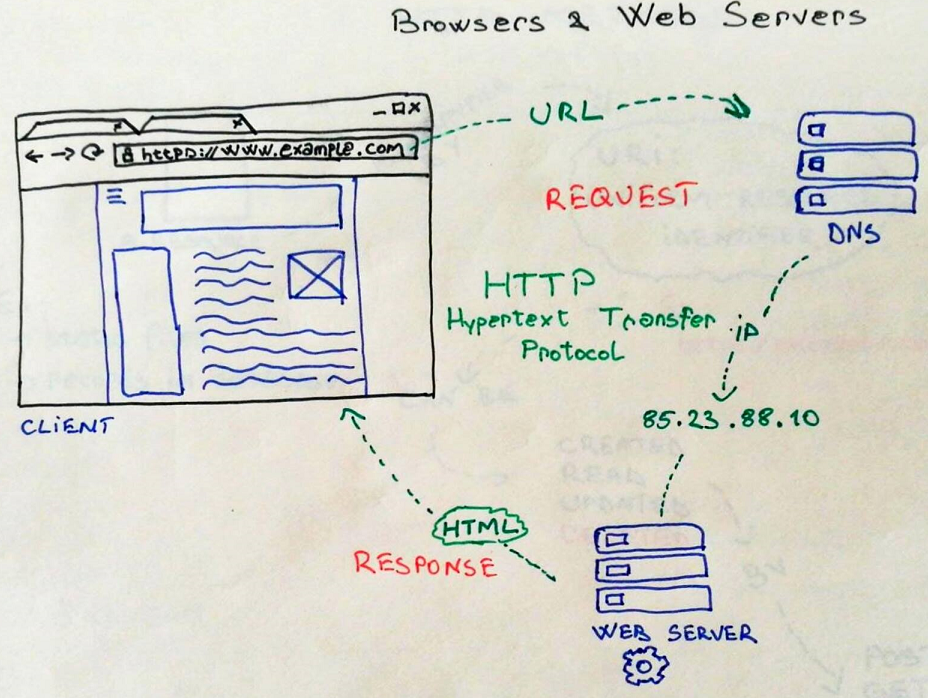
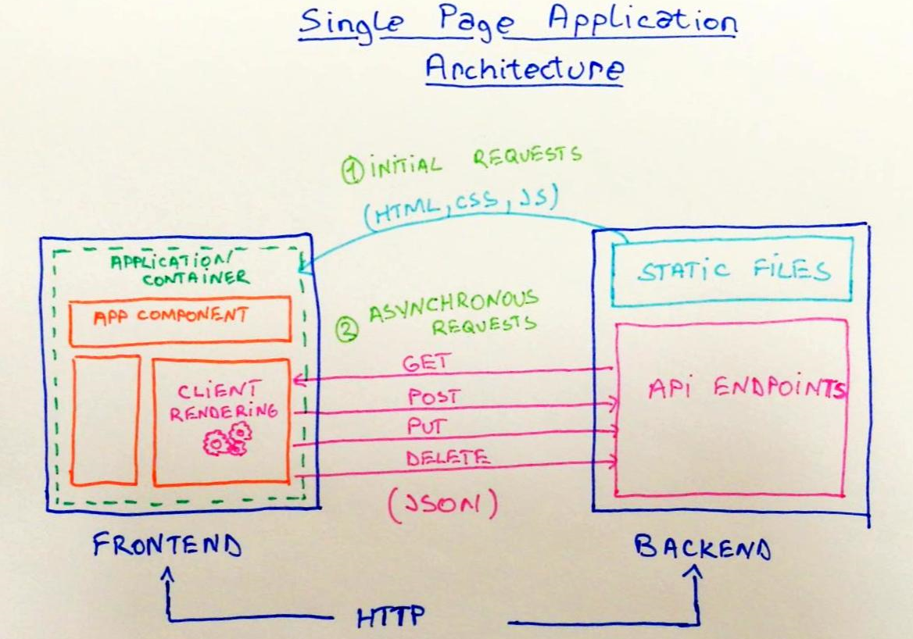
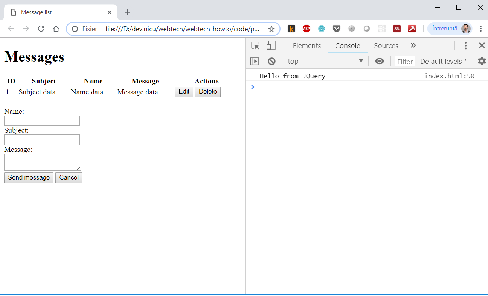

# tutorial-frontend

## Introducere

În prima parte am construit un server web capabil să servească fișiere statice și să expună date pentru a realiza operațiile de creare, citire, actualizare și ștergere \(CRUD\). În a doua parte vom dezvolta o interfață minimalistă cu scopul de a exemplifica metodele de comunicare între componenta de frontend și componenta de backend.

În general dezvoltarea de frontend este un proces iterativ ce presupune realizarea de schițe de design întermediare, care sunt validate cu utilizatorii, transformarea acestora în cod HTML și CSS, implementarea de cod care gestionează interacțiunea cu utilizatorul, testare și lansare în producție.

Dacă pe partea de backend procesul este destul de bine structurat și omogen în diferite limbaje de programare, dezvoltarea de frontend conține elemente subiective care țin de estetică, stil, aspect.

Modul în care ajungi să realizezi o pagină web este într-o măsură diferit de procesul cu care suntem obișnuiți să rezolvăm probleme într-un context de învățare tradițional. De obicei pornim de la o serie de date de intrare pentru care trebuie să obținem un rezultat aplicând o serie de pași. Dacă ai respectat pașii corect atunci rezultatul va fi corect. În acest sens instructiunile din acest tutorial sunt mai degrabă orientative și au rolul de a oferi un punct de plecare. Scopul acestui tutorial este mai degrabă să ofere cîteva elemente de structură, să exemplifice modul de comunicare între client \(frontend\) și server \(backend\) și să demonstreze accesul la date prin HTTP.

## Realizarea unei schițe de design

În dezvoltare web pornești de cele mai multe ori de la o problemă vag definită pe care un utilizator o are, te gandești la o interfață pe care o prototipezi, realizezi o schiță de design. Pornind de la o schiță identifici elementele html necesare și determini pașii prin care să implementezi rezultatul dorit.

Vom reprezenta datele sub forma unui tabel în care fiecare rând reprezintă o înregistrare din baza de date. Tabelul va avea o secțiune de antet care va fi statică și o secțiune dinamică pe care o vom construi în funcție de datele primite de pe server. Fiecare înregistrare va permite acțiunile de editare și stergere pe care le vom reprezenta prin două elemente de tip buton.

Pentru a captura datele de la utilizator vom folosi un formular cu elemente de tip text și un buton care să activeze acțiunea de prelucrare a datelor.

## Transformare schiței în cod HTML

HTML este un limbaj care se învațâ pe parcurs. Fiecare element are o reprezentare standard în browserele web ce poate fi extinsă folosind clase de stil CSS.

Pornim de la structura unui document HTML în care vom adăuga codul pentru a realiza un tabel și cel pentru a realiza un formular în secțiunea `body` a documentului.

```markup
<!DOCTYPE html>
<html>
    <head>
        <title>Message list</title>
    </head>
    <body>
        <h1>Messages</h1>
    </body>
</html>
```

Elementele HTML necesare realizării unui tabel - [https://www.w3schools.com/html/html\_tables.asp](https://www.w3schools.com/html/html_tables.asp)

Codul pentru a reprezenta un tabel va arăta astfel:

```markup
<table style="width:100%;">
    <tr>
        <th>ID</th>
        <th>Subject</th>
        <th>Name</th> 
        <th>Message</th>
        <th>Actions</th>
    </tr>
    <tr>
        <td>1</td>
        <td>Subject data</td>
        <td>Name data</td>
        <td>Message data</td>
        <td>
            <button>Edit</button>
            <button>Delete</button>
        </td>
    </tr>
</table>
```

Elementele HTML necesare realizării unui formular - [https://www.w3schools.com/html/html\_forms.asp](https://www.w3schools.com/html/html_forms.asp)

Iar codul pentru a reprezenta un formular va fi acesta:

```markup
<form>
  <input type="hidden" name="id" id="id" /><br />
  Name:<br />
  <input type="text" name="name" id="name" /><br />
  Subject:<br />
  <input type="text" name="subject" id="subject"><br/>
  Message:<br />
  <textarea name="message" id="message"></textarea> <br/>
  <input type="submit" value="Save message">
  <input type="reset" value="Cancel">
</form>
```

De asemenea vom adăuga un element `div` identificat cu id-ul `table` în care vom genera dinamic tabelul de mai sus folosind datele extrase din API.

```markup
<div id="table"></div>
```

În final dacă deschid documentul HTML în Chrome rezultatul va arăta astfel.


Chrome îmi permite să inspectez codul sursă al unui document HTML din secțiunea Elements a consolei pentru dezvoltatori. Pentru a accesa această secțiune voi realiza combinația de taste `Ctrl + Shift + I`


## Arhitectura aplicației web

Înainte de a trece la implementare să ne luăm câteva momente pentru a reflecta la modul în care un utilizator va interacționa cu această pagină web și care este parcursul pe care în vor avea datele în arhitectura aplicației noastre.

În primul rând când utilizatorul va deschide o pagină web tastând adresa URL, browserul va translata această adresă text prin intermediul unui serviciu DNS într-o adresă IP care identifăcă serverul pe care site-ul este găzduit. Apoi va lansa o cerere HTTP către serverul web specificând adresa resursei accesată.



Serverul web va prelucra această cerere și va returna continutul text în cazul nostru în format HTML pe care browserul îl va interpreta și îl va afișa utilizatorului nostru.

Într-o arhitectură de tip Single Page Application cererea inițială va întoarce doar un schelet al paginii web, urmând ca date să fie accesate prin cereri ulterioare de tip GET, POST, PUT sau DELETE.

În acest context vom avea un flux asincron de date între pagina web client și server pentru fiecare eveniment declanșat de o acțiune pe care utilizatorul o va realiza în pagină.



De exemplu evenimentul declanșat atunci când pagina este încărcată `onload` va determina o cerere de tip GET care va furniza lista de mesaje pe care o vom afișa în tabel.

Apăsarea butonului de ștergere pentru o înregistrare va determina o cerere de tip DELETE. Completarea formularului și apăsarea butonului salvează va determina o cerere de tip POST dacă este vorba de adăugarea unei înregistrări noi sau o cerere de tip PUT dacă este vorba de editarea unei înregistrări existente.

Pentru a realiza comunicarea asincronă vom folosi biblioteca [axios](https://github.com/axios/axios) pe care o vom include în pagină inserând următorul cod înainte de tagul `</body>` ce închide secțiunea de conținut HTML:

```markup
<script src="https://unpkg.com/axios/dist/axios.min.js"></script>
```

Pentru a realiza operații pe elementele HTML din pagină vom folosi biblioteca [JQuery](https://jquery.com/) pe care o includem de asemenea în documentul HTML.

```markup
<script 
    src="https://code.jquery.com/jquery-3.3.1.min.js"
    integrity="sha256-FgpCb/KJQlLNfOu91ta32o/NMZxltwRo8QtmkMRdAu8="
    crossorigin="anonymous"></script>
```

Pentru a testa că JQuery a fost inclus cu succes vom adăuga următorul snippet de code ce tipărește în consolă mesajul `Hello form JQuery`.

```markup
<script type="text/javascript">
    $(document).ready(function() {
        console.log('Hello from JQuery')
    })
</script>
```

Observăm că pentru evenimentul `ready` care este declanșat atunci când toate resursele din pagina html s-au încărcat este definită o funcție ce aplează metoda log pe obiectul console. Parametrul primit de metoda log este un string ce va fi tipăit în consola JavaScript a browserului web pe care o pot accesa în Chrome folosind combinația de taste `Ctrl + Shift + I`.



Această consolă îmi permite să aplelez orice funcție JavaScript sau să tipăresc conținutul unei variabile pe care vreau să inspectez atunci cand dezvolt o aplicație.

Având aceste elemente de bază în următoarele secțiuni vom implementa partea dinamică a paginii prin care realizăm conexiunea cu datele furnizate de server.

## Citire și afișare date de pe server \(GET\)

Până acum am definit documentele HTML ca fiind o structură de text statică ce va fi afișată de către browser în funcție de modul în care sunt interpretate tag-urile folosite.

În acest pas vom folosi axios pentru a prelua date de server in format JSON, apoi parcurgând acele date vom construi dinamic codul HTML pentru a afșa tabelul. În final îl vom insera în pagină în div-ul a cărui id definit este `table` folosind funcția html din JQuery.

```javascript
function showMessages() {
    axios.get('/messages').then(function(results) {

        let html = ` <table style="width:500px;">
                <tr>
                    <th>ID</th>
                    <th>Subject</th>
                    <th>Name</th> 
                    <th>Message</th>
                    <th>Actions</th>
                </tr>`

        results.data.forEach(function(element) {
            html += `<tr>
                        <td>${element.id}</td>
                        <td>${element.name}</td>
                        <td>${element.subject}</td>
                        <td>${element.message}</td>
                        <td>
                            <button onClick="editMessage(${element.id})">Edit</button>
                            <button onClick="deleteMessage(${element.id})">Delete</button>
                        </td>
                    </tr>`
        })

        html += `</table>`

        $('#table').html(html)
    }).catch(function(error) {
        console.log(error)
    })
}
```

Pentru a testa funcția o vom apela pe eveninimentul `ready`

```markup
<script type="text/javascript">
    $(document).ready(function() {
        console.log('Hello from JQuery')
        showMessages()
    })
</script>
```

Observăm în acest exemplu câteva elemente specifice de limbaj precum modul în care se definește o funcție, modul în care se definește o variabilă de tip string și operația de concatenare.

Axios expune metoda `get` pentru care se transmite ca parametru adresa resursei de pe server pe care o interoghez. În cazul nostru `/messages` va fi transformat într-un request către adresa de bază a aplicației plus endpoint-ul transmis ca parametru \(ex [https://example.com/messages](https://example.com/messages)\).

Fiindcă avem de a face cu o metodă ce va prelucra cererea asincron rezultatul returnat de apel va fi un obiect de tip `Promise`. Pe acest obiect vom transmite două funcții către cele două metode `then()` și `catch()` care vor fi apelate atunci când cererea este îndeplinită cu succes, respectiv dacă a intervenit o eroare. Detaliile privind acest mecanism sunt descrise aici: [https://developer.mozilla.org/en-US/docs/Web/JavaScript/Reference/Global\_Objects/Promise](https://developer.mozilla.org/en-US/docs/Web/JavaScript/Reference/Global_Objects/Promise)

## Prelucrare date din formular

Comportamentul standard al unui formular este să transmită datele prin GET către adresa curentă a documentului în care este inclus formularul transmis. Datele vor fi stransmise ca un șir de proprietăți cheie valoare.

Pentru a suprascrie acest comportament și a implementa un mecanism asincron de a transmite date către enpoint-urile create pe server vom implementa o funcție în JavaScript pe care o vom transmite pe evenimentul `onSubmit`. Fiind o funcție care gestionează un eveniment acesteia îi va fi pasat parametrul `event`, un obiect care conține detalii despre formularul ce a inițiat acel eveniment.

```markup
<form onSubmit="saveMessage(event)">
    ...
</form>
```

Înainte de a implementa această funcție să ne gândim la logica pe care trebuie să o aibă.

În primul rând mecanismul standard de transmitere a formularului ar trebui suprascris apelând metoda `event.preventDefault()`

Apoi vom avea nevoie de un mecanism prin care să accesăm valorile din câmpurile definite în formular. Fiind în contextul unui eveniment lansat pe metoda onsubmit am posibilitatea de a accesa aceste valori prin `event.target`.

Dar pentru a prezenta un mecanism general de preluare valori pentru un element input vom folosi metoda `val()` din JQuery. Aceasta presupune să definesc un selector pentru elementul respectiv. În cazul nostru vom defini unul după id-ul unic asignat fiecărui element din formular și să apelez metoda val\(\). Un exemplu pentru o astfel de sintaxă este: `$('#subject').val()` care va căuta elementul cu id-ul subject și va returna valoarea tastată în acel câmp text.

Având acest mecanism de a accesa valorile din formular voi defini câte o variabilă pentru fiecare element.

Următorul pas ar fi să determin dacă este vorba de o operație de editare a unuei înregistrări existente sau de adăugare a unei înregistrari noi. În primul caz vom transmite datele către server prin metoda PUT către endpoint-ul `/messages/:id` cu valoarea id preluată din formular, iar în ar doilea caz vom transmite datele către server prin metoda POST către endpoint-ul `/messages`.

```javascript
function saveMessage(event) {
    event.preventDefault()

    let id = $('#id').val()
    let name = $('#name').val()
    let subject = $('#subject').val()
    let message = $('#message').val() 

    if(id) {
        //make a request to PUT /messages/:id
    } else {
        //make a request to POST /messages
    }

}
```

Implementarea efectivă a fiecărei metode va fi făcută în sectiunea următoare.

### Transmitere și salvare date \(POST\)

O convenție a standardului REST este de a folosi POST pentru a crea o resursă nouă. Cu axios o astfel de cerere se execută folosind funcția `post()`. Primul parametru este adresa resursei, iar al doilea este un obiect ce descrie datele transmise către server.

```javascript
axios.post('/messages', {
    name: name,
    subject: subject,
    message: message
}).then(function(result) {
    showMessages()
    $(event.target).trigger("reset")
}).catch(function(err) {
    alert('Resource could not be saved')
})
```

În cazul în care cererea a fost îndeplinită cu succes vom apela funcția `showMessages` pentru a afișa tabelul cu datele actualizate, altfel vom afișa un mesaj de eroare. Codul va fi adăugat pe ramura `else` din funcția `saveMessage()`.

## Implementare metodă actualizare \(PUT\)

Pentru a implementa mecanismul de editare vom adăuga o nouă funcție `editMessage(id)` care are ca parametru id-ul mesajului de editat. Apoi vom implementa în funcția `saveMessage` cererea de tip PUT.

```javascript
function editMessage(id) {
    //get the values from the server
    axios.get('/messages/'+id).then(function(result) {
        //display values in the form
        $('#id').val(result.data.id)
        $('#name').val(result.data.name)
        $('#subject').val(result.data.subject)
        $('#message').val(result.data.mesage) 
    }).catch(function(err) {
        console.log(err)
        alert('Could not find resource')
    })
}
```

În final vom adăuga pe ramura if din funcția `saveMessage` apelul către endpoint-ul `PUT /messages/:id`

```javascript
axios.put('/messages/'+id, {
    name: name,
    subject: subject,
    message: message
}).then(function(result) {
    showMessages()
    $(event.target).trigger("reset")
}).catch(function(err) {
    alert('Resource could not be saved')
})
```

## Implementare metodă ștergere \(DELTE\)

Ștergerea unui mesaj se va realiza implementând o funcție ce primește ca parametru id-ul resursei și realizează o cerere de tip DELETE către endpoint-ul `/messages/:id`

```javascript
deleteMessage(id) {
    axios.delete('/messages/'+id).then(function(result) {
        showMessages()
    }).catch(function(err) {
        alert('Resource could not delete resource')
    }) 
}
```

