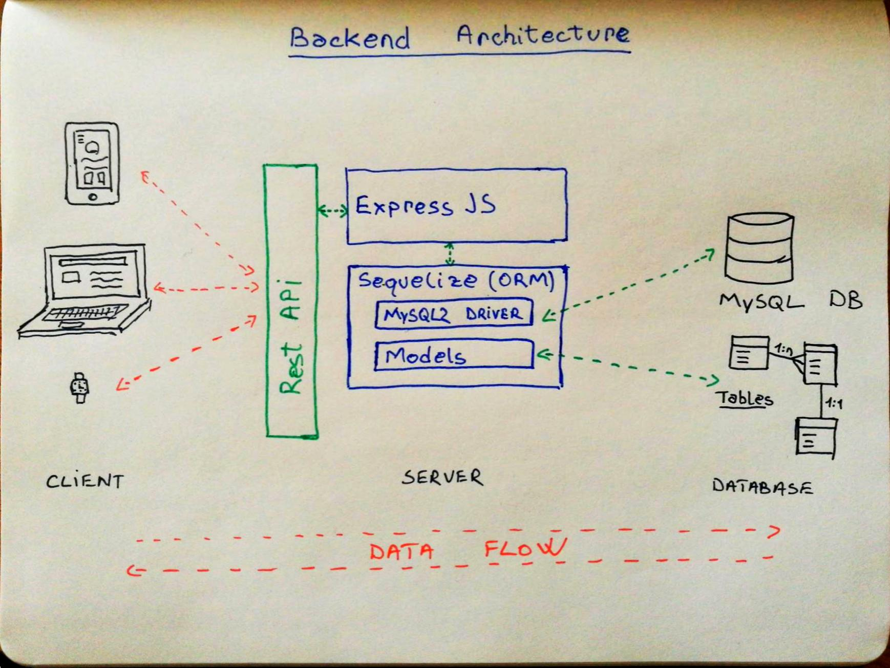
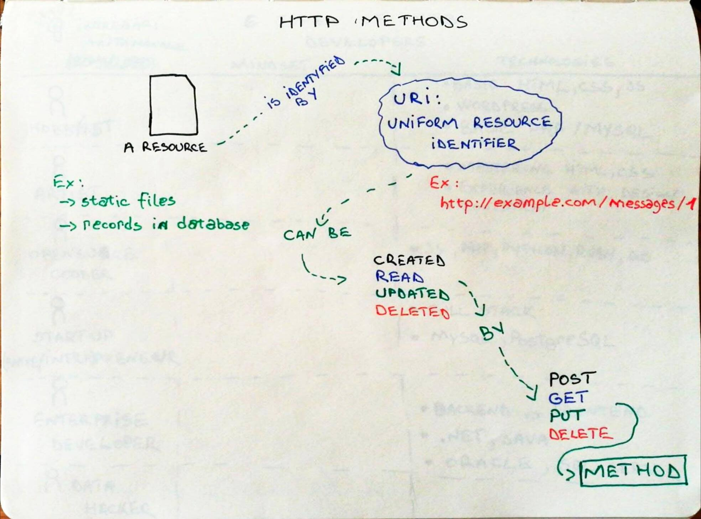
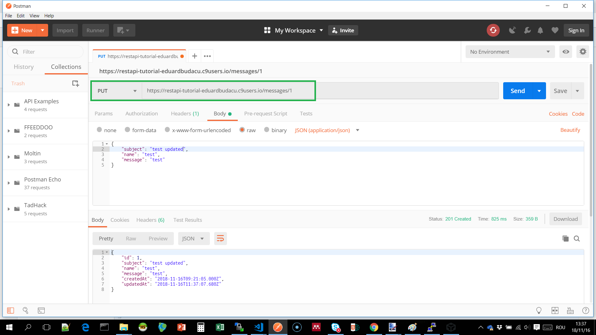

# Construirea unui API RESTful

Un API RESTful reprezintă o metodă de a expune date și de a realiza operații pe acele date prin intermediul protocolului HTTP.

În acest exercițiu construim un server web cu ajutorul NodeJS și al framework-ului ExpressJS. Datele sunt stocate într-o bază de date relațională MySQL. Accesul la date se face prin Sequelize.



## Ce vei avea nevoie?

* Un mediul de lucru integrat (IDE) sau un editor text
* NodeJS versiunea >= 8.9
* O instanță de MySQL
* Postman

## 1. Cum inițializez o aplicație NodeJS?

Pentru a inițializa o aplicație NodeJS execut următoarea comandă din terminal si completez detaliile pentru proiect

```bash
npm init
```
Urmăresc instrucțiunile de pe ecran și completez următoarele detalii:
* Name - numele proiectului
* Version - versiunea proiectului (default) - trec peste apasand ENTER
* Description - o descriere succintă
* Entry point - fișierul care pornește aplicația: server.js
* Test command - trec peste apasand ENTER
* Git repository - trec peste apasand ENTER
* Keywords - trec peste apasand ENTER
* Author - trec peste apasand ENTER
* License - trec peste apasand ENTER

Pe ecran va aparea un mesaj de confirmare:


Confrim dacă datele introduse sunt corecte. Dacă am executat comanda cu succes voi obține un fișier ***pagckage.json*** cu datele introduse.

- [ ] TODO: verifică existența fișierului package.json
- [ ] TODO: crează un fișier ***server.js***


## 2. Cum construiesc un server HTTP folosind ExpressJS?

ExpressJS este un framework minimalist pentru dezvoltarea de aplicații web, mobile sau servicii web REST (API).

Pentru descărca modulul și a include express în lista de dependințe execută comanda

```bash
npm install express --save
```

Editează fișierul ***server.js*** și adaugă modulul express

```js
const express = require('express')
```

Pentru a folosi Express definește o constată ```app``` astfel

```js
const app = express()
```

Pentru a servi fișiere statice precum imagini, documente html, css sau javascript folosește ```express.static```

```js
app.use('/', express.static('public'))
```

Primul parametru reprezintă calea din adresa url. Al doilea parametru este un apel al metodei ```static``` care primește calea către directorul în care sunt stocate fișierele statice.

În final voi specifica portul pe care serverul va asculta cererile HTTP.

```js
app.listen(8080)
```

Pentru a rula programul deschid fisierul ```server.js``` și apăs butonul RUN

- [ ] TODO: crează un director denumit ```public```
- [ ] TODO: adaugă în directorul creat un fișier ```index.html```
- [ ] TODO: deschide în browser aplicația accesând adresa URL (http://localhost:8080)


## 3. Cum instalez MySQL și cum creez baza de date?

Cloud9 pune la dispoziție un utilitar pentru configurarea unui serviciu de MySQL denumit ***mysql-ctl***

Pentru a instala și porni serverul de baze de date rulez comanda:

```bash
mysql-ctl start
```

Conectarea la serverul de baza de date se realizează executând urmatoarea comandă. Parametrul urmat dupa -u indică numele utilizatorului cu care mă conectez. În cazul de față este ```root``` fără parola.

```bash
mysql -u root
```

Din consola MySQL voi rula comenzi SQL. Sfârșitul unei comenzi este marcat de **caracterul ;**

De exemplu pentru a crea baza de date cu numele **profile** voi executa

```sql
create database profile;
```

Notă: Utilitarul ```mysql-ctl``` este specific mediului Cloud9. Mai multe detalii despre instalarea și configurarea MySQL pe un alt sistem de operare în documentația oficială (https://dev.mysql.com/doc/mysql-installation-excerpt/5.7/en/)

- [ ] TODO: verifică dacă baza de date a fost creată cu succes executând ```show databases;```
- [ ] TODO: părăsește consola mysql executând comanda ```exit```

## 4. Cum mă conectez la baza de date din NodeJS folosind Sequelize?

Sequelize este o bibliotecă orientată obiect de tip ORM (object-relational mapping). Permite realizarea unei reperezentări a tabelelor din baza de date prin modele și relații între modele. Un model este un obiect ce permite operațiile standard pe baza de date (Create, Read, Update, Delete). Documentația oficială este accesibilă aici: http://docs.sequelizejs.com/

Pentru a folosi Sequelize în proiect sunt necesare pachetele **sequelize** și **mysql2** pe care le vom instala prin ```npm```

```bash
npm install --save sequelize
```

```bash
npm install --save mysql2
```

Următorul pas presupune includerea pachetului în fișierul server.js și instanțierea unui obiect ```sequelize```

```js
const Sequelize = require('sequelize')

const sequelize = new Sequelize('profile', 'root', '', {
    dialect: "mysql",
    host: "localhost"
})
```

Fac distincție între obiectul ```sequelize``` și clasa ```Sequelize``` scrisă cu literă mare. În contstructorul clasei primul parametru este numele bazei de date, al doilea prametru este utilizatorul și al treilea este parola. Ultimul parametru este un obiect ce descrie date despre tipul de bază de date folosit și adresa serverului.

Pentru a realiza conexiunea la baza de date utilizez metoda **authenticate()**

Metoda returnează un obiect de tip ```Promise``` pentru care trebuie să specific funcțiile pe care să le apeleze atunct când conexiunea se realizează cu succes, respectiv întâmpin o eroare.

```js
sequelize.authenticate().then(() => {
    console.log("Connected to database")
}).catch(() => {
    console.log("Unable to connect to database")
})
```

- [ ] TODO: testează conexiunea rulând ```server.js```
- [ ] TODO: verifică în conoslă dacă apare mesajul **Conected to database**

## 5. Cum definesc modele pentru tabele folosind Sequelize?

Un model este o reprezentare a unui tabel în codul sursă al aplicației. Sequelize permite definirea de modele folosind funcția ***define()***

Primul parametrul al funcției este numele tabelului. O convenție presupusă de lucru cu Sequelize este că numele tabelului va fi definit în limba engleză la plural. Al doilea parametru este un obiect care descrie structura tabelului prin perechi cheie:valoare, unde cheia este numele coloanei și valoarea este tipul de date.

```js
const Messages = sequelize.define('messages', {
    subject: Sequelize.STRING,
    name: Sequelize.STRING,
    message: Sequelize.TEXT
})
```

Mai multe detalii despre definirea de modele - http://docs.sequelizejs.com/manual/tutorial/models-definition.html

Lista cu tipurile de date suportate de Sequelize - http://docs.sequelizejs.com/manual/tutorial/models-definition.html#data-types

Pentru a modela o aplicație este necesar să pornești de la domeniul pe care îl adresează, să identifici entități și relații între entități, să stabilești care sunt proprietățile lor și să identifici tipurile de date corespunzătoare. Este o activitate ce se desfășoară de obicei iterativ și incremenental pe parcursul dezvoltării aplicației. Așa că Sequelize propune un mecanism automat de sincronizare a bazei de date care este descris în pasul următor.

## 6. Cum creez tabelele în baza de date folosind mecanismul de sincronizare din Sequelize?

Sequelize permite sincronizarea automată a modelelor cu baza de date prin intermediul funcției ***sync()***

Adădugând parametrul ```{force: true}``` tabelele existente vor fi șterse și vor fi create confrom definiției din model.

Pentru a defini tabelel în baza de date expun enpoint-ul GET /createdb

```js
app.get('/createdb', (request, response) => {
    sequelize.sync({force:true}).then(() => {
        response.status(200).send('tables created')
    }).catch((err) => {
        console.log(err)
        response.status(200).send('could not create tables')
    })
})
```
- [ ] TODO: accesează din browser endpoint-ul /createdb
- [ ] TODO: testează dacă tabelul a fost creat executând în consola mysql comenzile ```use profile``` pentru a selecta baza de date și ```show tables;``` pentru a afișa lista de tabele din baza de date

## Metode HTTP

În continuare vom dezvolta metode HTTP pentru fiecare operație Create, Read, Update, Delete



## 7. Cum creez o nouă înregistrare într-un tabel folosind metoda POST?

Pentru a permite crearea de înregistrări expun o metodă de tip POST. 

Fiecare endpoint din API-ul REST este definită de metoda HTTP și numele resursei la care se referă.

```
POST /messages
```

Clientul va trimite datele prin cererea HTTP în format ```json``` sau ```urlencoded```. Pentru a interpreta aceste date voi adăuga două bodyParser. Apoi definesc endpoint-ul apelând functia ```app.post```.

```js
app.use(express.json())
app.use(express.urlencoded())

//definire endpoint POST /messages
app.post('/messages', (request, response) => {
    Messages.create(request.body).then((result) => {
        response.status(201).json(result)
    }).catch((err) => {
        response.status(500).send("resource not created")
    })
})
```

Conținutul trimis în body va fi accesibil pe proprietatea ```request.body``` ce va fi pasat ca parametru pentru modelul Sequelize în metoda create().

Metoda **create** Sequelize va genera automat instrucțiunea ```INSERT INTO messages (`subject`, `name`, `message`) VALUES ('test','test','test')```.

Dacă comanda va fi executată cu succes rezultatul va fi returnat prin functia callback definită pe metoda ```then(callback)```

Dacă aplicația va întâmpina o eroare la scriere în baza de date va apela functia callback definită pe metoda ```catch(callback)```

Pentru a testa enpoint-ul creat folosim Postman. 


1. Selectează metoda POST
2. Adaugă adresa URL a resursei
3. În tabul body alege optiunea raw și adaugă un obiect json care descrie resursa creată
4. Selectează tipul de continut application/json
5. Trimite cererea HTTP apăsând butonul Send


## 8. Cum expun datele dintr-un tabel folosind metoda GET?

Pentru a lista datele dintr-un tabel vom expune două enpoint-uri. Primul care returnează toată lista de mesaje și al doilea care returnează un mesaj după un ID specific.

```
GET /messages
```

```
GET /messages/1
```

Pentru interogarea tabelului modelul sequelize expune metode precum ```findAll```, ```findById```, ```findOne```. Functia va returna un obiect de tip ```Promise``` ce va fi executat imediat ce datele sunt primite de la serverul de baze de date. Mai multe detalii despre interogari aici: http://docs.sequelizejs.com/manual/tutorial/querying.html 

```js
app.get('/messages', (request, response) => {
    Messages.findAll().then((results) => {
        response.status(200).json(results)
    })
})

app.get('/messages/:id', (request, response) => {
    Messages.findById(request.params.id).then((result) => {
        if(result) {
            response.status(200).json(result)
        } else {
            response.status(404).send('resource not found')
        }
    }).catch((err) => {
        console.log(err)
        response.status(500).send('database error')
    })
})
```

- [ ] TODO: testează endpoint-urile create folosind Postman


## 9. Cum actualizez o înregistrare folosind metoda PUT?

Actualizarea unei resurse se realizează prin intermediul metodei PUT

```
PUT /messages/1
```

În primul pas se interoghează baza de date. Dacă resursa nu există serverul va returna statusul 404 și mesajul „not found„. 

Dacă resursa a fost găsită o actualizez apelând metoda ```update()``` cu obiectul trimis în body-ul cererii HTTP. 

```js
app.put('/messages/:id', (request, response) => {
    Messages.findById(request.params.id).then((message) => {
        if(message) {
            message.update(request.body).then((result) => {
                response.status(201).json(result)
            }).catch((err) => {
                console.log(err)
                response.status(500).send('database error')
            })
        } else {
            response.status(404).send('resource not found')
        }
    }).catch((err) => {
        console.log(err)
        response.status(500).send('database error')
    })
})
```

Pașii pentru a testa metoda PUT sunt aceiași ca pentru metoda POST.



## 10. Cum șterg o înregistrare folosind metoda DELETE?

Ultima metodă permite ștergerea unei resurse

```
DELETE /messages/1
```
Dacă resursa este găsită după ID, apelez metoda ```destroy```,iar sequelize va transmite către baza de date instructiunea sql ```DELETE FROM `messages` WHERE id = 1``` și va returna un obiect de tip ```Promise```. În final serverul web va raspunde cu statusul **204 NO CONTENT** semnalând că cererea a fost îndeplinită cu succes.

```js
app.delete('/messages/:id', (request, response) => {
    Messages.findById(request.params.id).then((message) => {
        if(message) {
            message.destroy().then((result) => {
                response.status(204).send()
            }).catch((err) => {
                console.log(err)
                response.status(500).send('database error')
            })
        } else {
            response.status(404).send('resource not found')
        }
    }).catch((err) => {
        console.log(err)
        response.status(500).send('database error')
    })
})
```
- [ ] TODO: testează enpoint-ul în Postman folosind metoda DELETE

## Next steps...

Dacă ai reușit să parcurgi tutorialul până aici, în primul rând felicitări pentru efort!

Iată câteva resurse care te vor ajuta să aprofundezi dezvoltarea de servicii web REST:

* https://www.restapitutorial.com/
* https://medium.com/pixelpoint/oh-man-look-at-your-api-22f330ab80d5
* https://www.toptal.com/laravel/restful-laravel-api-tutorial
* https://www.codementor.io/sagaragarwal94/building-a-basic-restful-api-in-python-58k02xsiq
